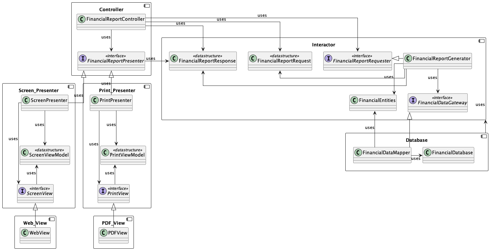

# archi-multi-component-example

You would create instances of these classes and wire them together according to the relationships defined in the diagram shown below (from Clean Architecure by Uncle Bob.).

 

This is typically done in a main application file or a dependency injection container.

Note: This implementation is a high-level guide and focuses on the structure rather than the detailed internal logic of each class, which would depend on your specific application requirements. The actual implementation may require additional details such as data models, database connections, UI frameworks, etc.
